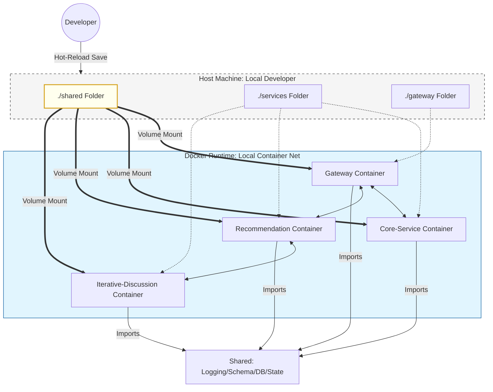
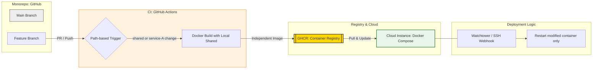

# 🍽️ 다모 (Damo): 스마트한 단체 회식 장소 추천

> **"오늘 회식 어디서 하지?"**  
> 더 이상 고민하지 마세요. AI가 여러분의 팀원 모두가 만족할 최적의 장소를 찾아드립니다.

---

## 기술 스택

### 아키텍처
- **LangGraph**: 복잡한 AI 워크플로우를 효율적으로 관리하기 위한 그래프 기반 아키텍처
- **FastAPI**: 고성능의 비동기 API 서버
- **CrewAI**: 회식 페르소나의 가상 추천 투표 시스템 구현을 위한 프레임워크

---

## 1. 🛠️ Local Development Scenario
개발 환경에서는 **Docker Volume Mount**를 통해 로컬의 `shared` 코드와 각 서비스 소스를 실시간으로 동기화(Hot-Reload)합니다.



---

## 2. 🚀 CI/CD Deployment Scenario
배포 환경에서는 **GitHub Actions**가 변경된 경로를 감지하여 독립적인 Docker 이미지를 빌드하고, 클라우드에 자동으로 반영(GitOps)합니다.



---

## 핵심 운영 원칙

| 구분 | Development (로컬) | Deployment (운영) |
| :--- | :--- | :--- |
| **공통 자원 관리** | `shared` 폴더 실시간 마운트 (Volume) | 이미지 빌드 시 `shared` 폴더 복사 (`COPY`) |
| **코드 반영** | 파일 저장 시 즉각 반영 (Hot-Reload) | Git Push 시 자동 빌드 및 갱신 (CI/CD) |
| **배포 단위** | 전체 `docker-compose.dev.yml` 실행 | 수정된 서비스만 선별적 이미지 교체 |
| **DB 접근** | 각 서비스가 `shared.database` 직접 참조 | 각 서비스가 `shared.database` 직접 참조 |

---

## 폴더 구조
```text
/root
  ├── gateway/                    # [관리: Hayden] 서비스 진입점 (API Gateway)
  │    ├── main.py                # 라우팅 로직
  │    └── Dockerfile             # 게이트웨이 빌드
  │
  ├── shared/                     # [공통] 전 팀원이 임포트하여 사용하는 라이브러리
  │    ├── database/              # MongoDB 연결 및 기본 CRUD 클라이언트
  │    ├── state/                 # 서비스 간 상태 추적 (Redis 등)
  │    ├── schemas/               # 모든 API 데이터 규격 (Pydantic 모델)
  │    ├── logging/               # 분산 로깅 및 X-Request-ID 전파
  │    └── utils/                 # 기타 공용 유틸
  │
  ├── services/                   # [기능 서비스] 마이크로서비스 엔진들
  │    │
  │    ├── core-service/          # [팀원 C] 경량 기능 통합 (Validation & Management)
  │    │    ├── app/
  │    │    │    ├── api/         # 세부 도메인별 라우터 분리
  │    │    │    │    ├── receipt.py
  │    │    │    │    ├── persona.py
  │    │    │    │    └── fix.py
  │    │    │    └── main.py      # Core 통합 엔드포인트
  │    │    └── Dockerfile
  │    │
  │    ├── recommendation/        # [팀원 A] 추천 알고리즘 엔진
  │    │    ├── app/
  │    │    │    └── main.py      # 추천 엔진 로직
  │    │    └── Dockerfile
  │    │
  │    └── iterative_discussion/  # [팀원 B] 대화 보정 엔진
  │         ├── app/
  │         │    └── main.py      # 대화 보정 로직
  │         └── Dockerfile
  │
  ├── docker-compose.dev.yml      # 로컬 개발용 통합 실행 파일
  ├── .env                        # DB URL 등 환경변수 관리
  ├── .gitignore                  # __pycache__ 등 제외
  └── requirements.txt            # 프로젝트 공통 패키지 명세
```